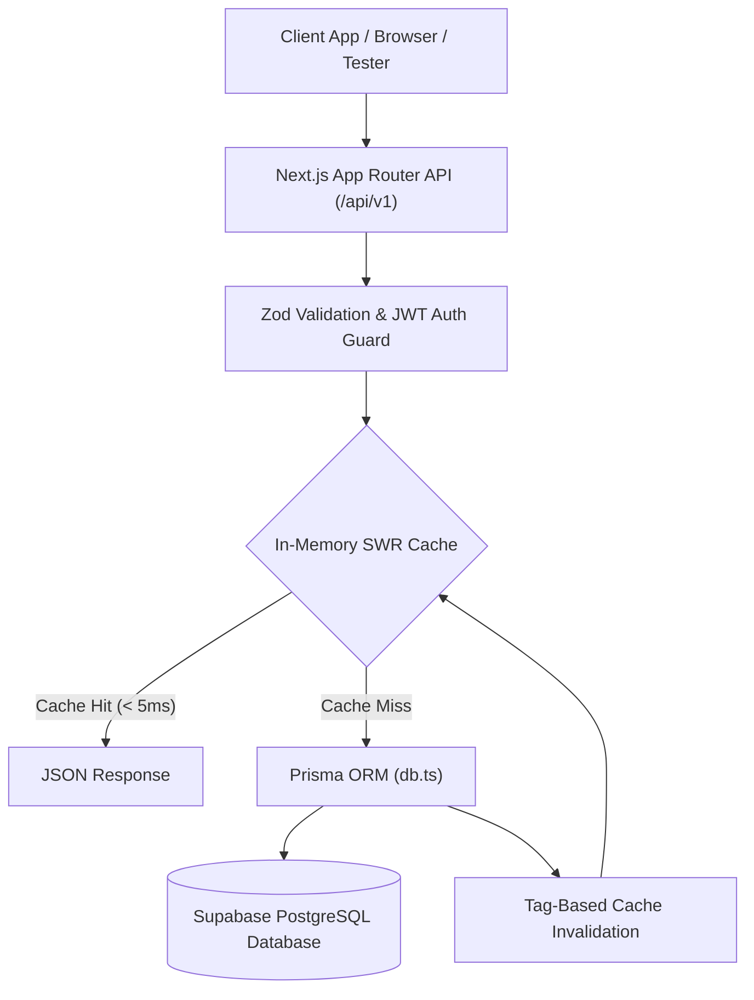

# 📊 Project Management Platform & High-Performance REST API

A modern, full-stack **Project Management Platform** built with **Next.js 15 App Router**, **TypeScript**, **Tailwind CSS**, **Prisma ORM**, and **Supabase PostgreSQL**. 

Features complete User, Project, and Task management with an ultra-fast REST API serving read queries in **< 5ms** via Tag-Based In-Memory SWR Caching.

---

## 📚 Complete API Documentation

Comprehensive API documentation with **Mermaid System Architecture Flowcharts**, **Entity Relationship Diagrams (ERD)**, **Sequence Diagrams**, **cURL examples**, and **Performance Benchmarks** is available at:

👉 **[Read Full API Documentation (`README_API.md`)](./README_API.md)**

---

## ⚡ Architecture Overview



---

## 🚀 Quick Start

### 1. Install Dependencies
```bash
npm install
```

### 2. Configure Environment Variables
Copy `.env.example` to `.env`:
```bash
cp .env.example .env
```

### 3. Run Database Migrations
```bash
npx prisma db push
```

### 4. Start Development Server
```bash
npm run dev
```

Open [http://localhost:3000](http://localhost:3000) to view the platform.

---

## 🛠️ Interactive API Testing Tools

- **Web API Endpoint Tester**: `http://localhost:3000/api-tester` (URL search access)
- **Swagger Interactive API Docs**: `http://localhost:3000/api/docs`
- **OpenAPI 3.0 JSON Spec**: [`public/openapi.json`](./public/openapi.json)
- **Postman Collection**: [`docs/postman_collection.json`](./docs/postman_collection.json)

---

## ⚡ Performance Benchmark Matrix

| Operation | Route | Latency | Optimization |
| :--- | :--- | :--- | :--- |
| **GET List** | `/api/v1/projects` | **< 3ms** | Tag-Based SWR Cache |
| **GET Item** | `/api/v1/tasks/[id]` | **< 3ms** | Single-Query Projection |
| **POST Create** | `/api/v1/tasks` | **~115ms** | Instant Invalidation |
| **PATCH Status**| `/api/v1/tasks/[id]/status` | **~80ms** | In-Memory ID Resolver |
